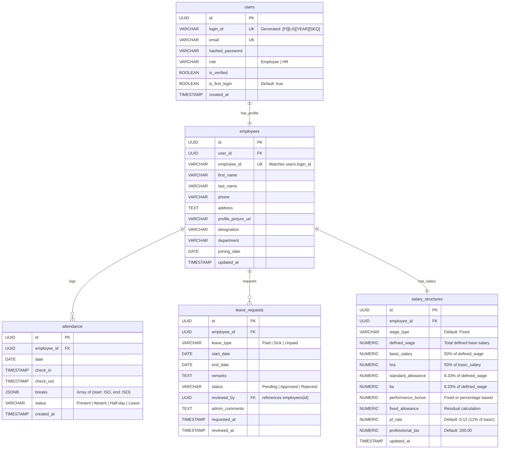

# Database Architecture: Dayflow HRMS

This document describes the schema design, tables, fields, relationships, and migration strategies for the PostgreSQL database powering the Dayflow HRMS.

---

## 1. Overview
Dayflow utilizes a relational **PostgreSQL** database. 
*   **Migrations**: Handled entirely via **Alembic** to track database version history and apply schema upgrades cleanly.
*   **ORM**: SQLAlchemy handles object-relational mapping.
*   **Authentication**: Custom tables and password hashing are implemented directly in the database (no third-party auth services).

---

## 2. Entity-Relationship Diagram


---

## 3. Schema Definitions

### 3.1 `users` Table
Stores login credentials and authorization status.
*   `id`: `UUID` (Primary Key, default: `uuid_generate_v4()`)
*   `login_id`: `VARCHAR(100)` (Unique, Indexed, Not Null) - E.g., `JODO2026001`
*   `email`: `VARCHAR(255)` (Unique, Indexed, Not Null)
*   `hashed_password`: `VARCHAR(255)` (Not Null)
*   `role`: `VARCHAR(50)` (Not Null, values: `Employee`, `HR`)
*   `is_verified`: `BOOLEAN` (Default: `false`)
*   `is_first_login`: `BOOLEAN` (Default: `true`) - Triggers password reset flow upon first login.
*   `created_at`: `TIMESTAMP` (Default: `CURRENT_TIMESTAMP`)

### 3.2 `employees` Table
Stores the profile and organizational details of each employee.
*   `id`: `UUID` (Primary Key, default: `uuid_generate_v4()`)
*   `user_id`: `UUID` (Foreign Key -> `users.id`, Unique, Cascade Delete)
*   `employee_id`: `VARCHAR(100)` (Unique, Indexed, Not Null, matches `users.login_id`)
*   `first_name`: `VARCHAR(100)` (Not Null)
*   `last_name`: `VARCHAR(100)` (Not Null)
*   `phone`: `VARCHAR(20)` (Nullable)
*   `address`: `TEXT` (Nullable)
*   `profile_picture_url`: `VARCHAR(500)` (Nullable)
*   `designation`: `VARCHAR(100)` (Nullable)
*   `department`: `VARCHAR(100)` (Nullable)
*   `joining_date`: `DATE` (Nullable)
*   `updated_at`: `TIMESTAMP` (Default: `CURRENT_TIMESTAMP` on update)

### 3.3 `attendance` Table
Logs daily check-in, check-out, and break events.
*   `id`: `UUID` (Primary Key, default: `uuid_generate_v4()`)
*   `employee_id`: `UUID` (Foreign Key -> `employees.id`, Not Null)
*   `date`: `DATE` (Indexed, Not Null)
*   `check_in`: `TIMESTAMP` (Nullable)
*   `check_out`: `TIMESTAMP` (Nullable)
*   `breaks`: `JSONB` (Nullable, default: `[]`) - Logs array of break intervals: `[{"start": "2026-08-22T13:00:00", "end": "2026-08-22T13:45:00"}]`
*   `status`: `VARCHAR(50)` (Not Null, default: `Present`, values: `Present`, `Absent`, `Half-day`, `Leave`)
*   `created_at`: `TIMESTAMP` (Default: `CURRENT_TIMESTAMP`)
*   *Unique Constraint*: Unique pair `(employee_id, date)` to enforce a single attendance log entry per day.

### 3.4 `leave_requests` Table
Tracks time-off submissions and reviews.
*   `id`: `UUID` (Primary Key)
*   `employee_id`: `UUID` (Foreign Key -> `employees.id`, Not Null)
*   `leave_type`: `VARCHAR(50)` (Not Null, values: `Paid`, `Sick`, `Unpaid`)
*   `start_date`: `DATE` (Not Null)
*   `end_date`: `DATE` (Not Null)
*   `remarks`: `TEXT` (Nullable)
*   `status`: `VARCHAR(50)` (Not Null, default: `Pending`, values: `Pending`, `Approved`, `Rejected`)
*   `reviewed_by`: `UUID` (Foreign Key -> `employees.id` references the HR personnel who approved/rejected it, Nullable)
*   `admin_comments`: `TEXT` (Nullable)
*   `requested_at`: `TIMESTAMP` (Default: `CURRENT_TIMESTAMP`)
*   `reviewed_at`: `TIMESTAMP` (Nullable)

### 3.5 `salary_structures` Table
Configures monthly salary breakdown parameters.
*   `id`: `UUID` (Primary Key)
*   `employee_id`: `UUID` (Foreign Key -> `employees.id`, Unique, Not Null)
*   `wage_type`: `VARCHAR(50)` (Not Null, default: `Fixed`)
*   `defined_wage`: `NUMERIC(12, 2)` (Not Null, default: `0.00`)
*   `basic_salary`: `NUMERIC(12, 2)` (Not Null, default: `0.00`)
*   `hra`: `NUMERIC(12, 2)` (Not Null, default: `0.00`)
*   `standard_allowance`: `NUMERIC(12, 2)` (Not Null, default: `0.00`)
*   `lta`: `NUMERIC(12, 2)` (Not Null, default: `0.00`)
*   `performance_bonus`: `NUMERIC(12, 2)` (Not Null, default: `0.00`)
*   `fixed_allowance`: `NUMERIC(12, 2)` (Not Null, default: `0.00`)
*   `pf_rate`: `NUMERIC(5, 4)` (Not Null, default: `0.1200`) - 12% PF rate.
*   `professional_tax`: `NUMERIC(12, 2)` (Not Null, default: `200.00`)
*   `updated_at`: `TIMESTAMP` (Default: `CURRENT_TIMESTAMP` on update)

---

## 4. Migration Strategy using Alembic
To maintain a clean migration sequence and align with best practices:
1.  **Setup**: Initialize alembic configuration using `alembic init alembic`.
2.  **Target Metadata**: Import and bind `Base` metadata from models in `alembic/env.py`.
3.  **Auto-generation**: Generate migrations using:
    ```bash
    alembic revision --autogenerate -m "Initial schema setup"
    ```
4.  **Execution**: Apply schema changes securely using:
    ```bash
    alembic upgrade head
    ```
